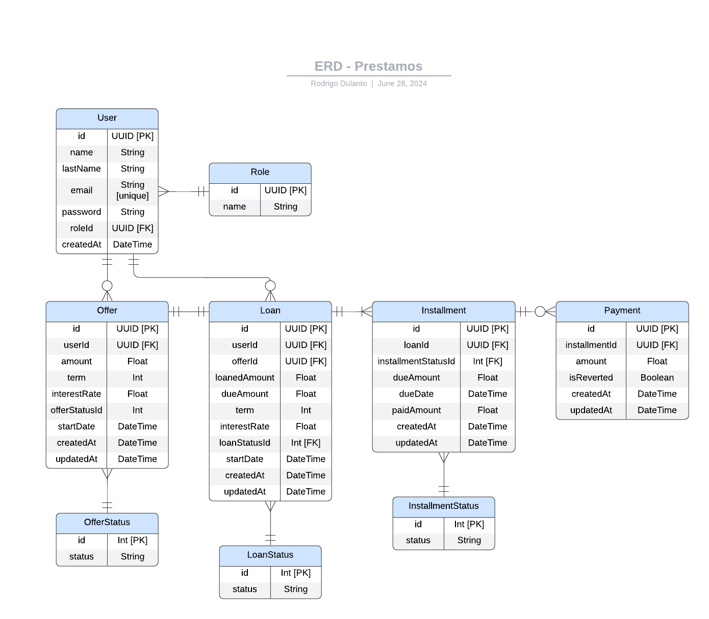

# Technical Assessment for Tech Lead position @ Amiloz 🧑‍💻

## 📈 Project Scope

This project is the MVP of a backend API server to simulate a loan management system.

#### 🎯 Initial considerations

To simplify some of the logic involved and to keep the scope of this MVP _10-hour-technical-assessment-ish_, I made some assumptions and decisions listed next. ~~Also because I'm not a financial expert in loans logic other than from the user perspective.~~

- The term periodicity of the loans is weekly, which means the installments will start one week after the scheduled start date for a loan.
- The interest rate periodicity is also weekly.
- The loan due amount will be equally split into the installments.
- Multiple _partial_ payments are supported for a single installment. When registering a payment, it will be associated to the installment whose due date is closest, and the amount cannot exceed the installment's due amount.

## ⚙️ Project Installation

#### :clipboard: Prerequisites

To install and run this project locally, you'll need the following dependencies:

- Node v20.12.2 (as specified in the .nvmrc file)
- `npm` as a package manager

#### :hammer_and_wrench: Steps to install

- First, create a `.env` file in the root folder (feel free to copy the `.env.template` file) and then set the corresponding values.

- Then feel free to run the following commands:

  ```sh
  # In project root

  nvm use       # Use Node version specified in .nvmrc
  npm install   # Install project dependencies

  # Run only if you wish to start with a fresh database
  rm -rf prisma/dev.db
  npx prisma generate
  npx prisma migrate dev
  # Otherwise, skip to next command

  npm run dev   # Run project locally
  ```

## 💻 Tech stack

- **NodeJs + Express** to create the backend server and endpoints.
- **TypeScript** for type safety.
- **SQLite** as a relational database engine.
- **Prisma ORM** for database interactions.
- **Zod** for schema-based data validation.
- **JWT - jsonwebtoken** for authentication management.

## 📄 Documentation

#### 📘 Entity Relationship Diagram



#### 🔗 Created Endpoints

This project is configured to use Swagger to document the endpoints based on the OpenAPI 3.0 specification. To access the docs page and start exploring, please go to `http://localhost:3000/docs` after booting up the server.

As per the required and optional functional requirements, this is a list of the endpoints created as part of this MVP:

##### 1. Create a user - `POST /usuarios`:

Allows the creation of a user.

- **Authentication**: For simplicity reasons, this endpoint doesn't require auth.
- **Request body**:
  ```js
  {
    "name": "Juan",
    "lastName": "Perez",
    "email": "juan@gmail.com",
    "password": "1234",
    "roleId": "roleId"
  }
  ```
- **Response**:
  ```js
  {
    "id": "string",
    "name": "string",
    "lastName": "string",
    "email": "string",
    "roleId": "string"
  }
  ```

##### 2. Login - `POST /usuarios/login`:

Allows a user to login using their access credentials.

- **Authentication**: This endpoint doesn't require auth.
- **Request body**:
  ```js
  {
    "email": "juan@gmail.com",
    "password": "1234"
  }
  ```
- **Response**:
  ```js
  {
    "token": "string"
  }
  ```

##### 3. Create offers for a user - `POST /usuarios/{userId}/ofertas`:

Allows an admin to create different offers for a user. The offers vary in settings such as amount to loan, term of loan and/or interest rate. A minimum of two offers have to be created at a time.

- **Authentication**: This endpoint can only be executed by an authenticated admin.
- **Request body**:
  ```js
  {
    "offers": [
      {
        "amount": 1000,
        "term": 6,
        "interestRate": 0.1,
        "offerStatusId": 1,
        "startDate": "2024-07-10"
      },
      {
        "amount": 1000,
        "term": 6,
        "interestRate": 0.1,
        "offerStatusId": 1,
        "startDate": "2024-07-10"
      }
    ]
  }
  ```
- **Response**:
  ```js
  {
    "offers": [
      {
        "id": "string",
        "userId": "string",
        "amount": 0,
        "term": 0,
        "interestRate": 0,
        "offerStatusId": 0,
        "startDate": "string",
        "createdAt": "string",
        "updatedAt": "string"
      }
    ]
  }
  ```

##### 4. Create a loan from an offer - `POST /usuarios/{userId}/prestamos`:

Allows a user to create a loan based on an existing offer. It creates the loan and all the installments associated with it.

- **Authentication**: This endpoint can only be executed by an authenticated **non-admin** user. An additional validation is performed to ensure the offer is associated to the authenticated user.
- **Request body**:
  ```js
  {
    "offerId": "string"
  }
  ```
- **Response**:
  ```js
  {
    "id": "string",
    "userId": "string",
    "offerId": "string",
    "loanedAmount": 0,
    "dueAmount": 0,
    "term": 0,
    "interestRate": 0,
    "loanStatusId": 0,
    "startDate": "string",
    "createdAt": "string",
    "updatedAt": "string",
    "installments": [
      {
        "id": "string",
        "loanId": "string",
        "installmentStatusId": 0,
        "dueAmount": 0,
        "dueDate": "string",
        "paidAmount": 0,
        "createdAt": "string",
        "updatedAt": "string"
      }
    ]
  }
  ```

##### 5. Register a payment for a loan - `POST /prestamos/{loanId}/pagos`:

Allows a user to register a payment for an installment associated to a loan. The payment will be registered to the installment whose due date is closest. When one or more payments cover all the installment's due amount, its status will be updated to _Complete_, otherwise it will be set to _Partial_. Similarly, if all the installments associated to a loan are completely paid, its status will be updated to _Paid_.

- **Authentication**: This endpoint can only be executed by an authenticated **non-admin** user. An additional validation is performed to ensure the offer is associated to said user.
- **Request body**:
  ```js
  {
    "amount": 100,
    "installmentId": "string"
  }
  ```
- **Response**:
  ```js
  {
    "payment": {
      "id": "string",
      "installmentId": "string",
      "amount": 0,
      "isReverted": true,
      "createdAt": "string",
      "updatedAt": "string"
    },
    "installment": {
      "id": "string",
      "loanId": "string",
      "installmentStatusId": 0,
      "dueAmount": 0,
      "dueDate": "string",
      "paidAmount": 0,
      "createdAt": "string",
      "updatedAt": "string"
    }
  }
  ```

##### 6. Revert a payment - `POST /pagos/{paymentId}/revertir`:

Allows a user to revert an existing payment. The logic to revert the payment includes reducing the paid amount attribute from the associated installment, and updating the installment and loan statuses accordingly.

- **Authentication**: This endpoint can only be executed by an authenticated **non-admin** user. An additional validation is performed to ensure the payment is associated to said user.
- **Request body**: Not required.
- **Response**:

  ```js
  {
    "payment": {
      "id": "string",
      "installmentId": "string",
      "amount": 0,
      "isReverted": true,
      "createdAt": "string",
      "updatedAt": "string"
    },
    "installment": {
      "id": "string",
      "loanId": "string",
      "installmentStatusId": 0,
      "dueAmount": 0,
      "dueDate": "string",
      "paidAmount": 0,
      "createdAt": "string",
      "updatedAt": "string"
    }
  }
  ```

## 🔜 Next steps

Here's a list of future initiatives that could be beneficial to include in the project (in no particular order).

- Refine the loaning logic so that it's possible to scale and support multiple currencies.
- Setup the project for internationalization. This includes extracting all the texts from the codebase and store them in a language-based file structure so that it's accessible when expanding to other countries.
- Add tests for the endpoints and ensure coverage on the most important elements of the loan logic.
